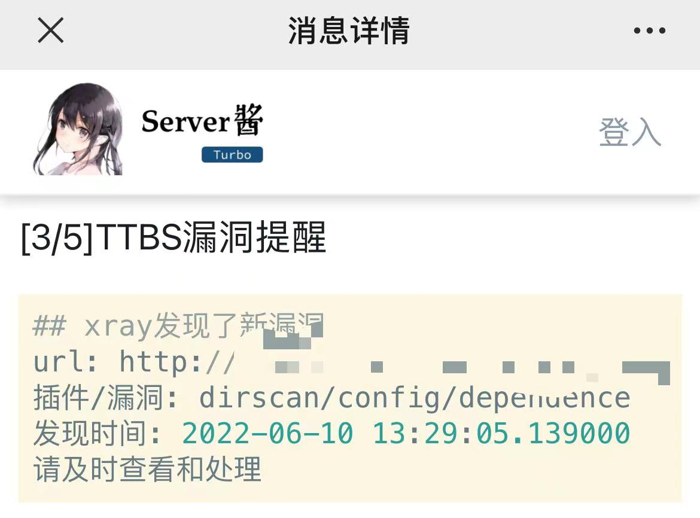
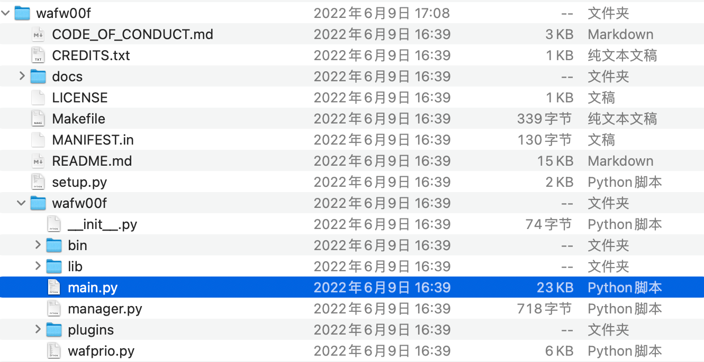

# 万佛朝宗

一款互联网暴露面资产快速打点工具

本工具旨在通过fofa等空间测绘工具进行子域名探索并通过调用xray等第三方漏洞扫描工具快速进行外网打点。


python3 TTBS.py





## 目录结构

```
│  app.py  //前台展示
│  TTBS.py  //程序入口
│  README.md
│  requirements.txt  
│  server.py  //漏洞推送、通知提醒
│  target.txt  //目标文件
│  
├─lib //插件目录
│		└  xray  //xray生成的html目录
│      config.py  //配置模块
│      craw_to_xray.py  //爬虫、漏洞抓取模块
│      read_target.py  //目标读取模块
│      run_html.py  //前台启动模块
│      sql_connect.py  //数据库相关模块
│      fofa_collect.py  //子域收集模块
│      waf_check.py  //waf检测模块
│      
├─logs
│      server.log  //漏洞推送日志
│      foa.log //fofa子域收集监控日志
│      xray.log
│      
├─img
│  └─README
│          
├─results
│      result.sqlite3  //数据库
│      
├─templates
│      index.html //主页文件
│      
└─tools
    ├  crawlergo  //一个使用chrome headless模式进行URL入口收集的动态爬虫
    ├  chrome  //chrome浏览器                    
    ├  wafW00f  //WAF指纹识别工具             
    └  xray  //一款躺着收洞的神器
```


## 配置文件

lib/config.py
记得根据自己的实际情况填写


## 工具目录

根据自己的系统进行下载，建议选用linux及mac系统运行

xray 

```
cd Ten-Thousand-Buddhas/tools/xray
wget https://github.com/chaitin/xray/releases/download/1.8.4/xray_linux_amd64.zip
unzip xray_linux_amd64.zip
mv xray_linux_amd64 xray
```


crawlergo

```
cd Ten-Thousand-Buddhas/tools/
git clone https://github.com/Qianlitp/crawlergo.git
cd crawlergo/cmd/crawlergo
go build
mv crawlergo ../../
```


wafW00f 

```
cd Ten-Thousand-Buddhas/tools/
git clone https://github.com/EnableSecurity/wafw00f.git
```




chrome

```bash
wget https://dl.google.com/linux/direct/google-chrome-stable_current_amd64.deb 
sudo dpkg -i google-chrome-stable_current_amd64.deb
sudo apt-get -f install
whereis google-chrome # 将获取到的chrome路径填写到lib/config.py的相应位置
```


## 参考资源

1. [Fofa - 网络空间测绘，网络空间安全搜索引擎，网络空间搜索引擎，安全态势感知](https://fofa.info)
2. [Crawlergo - 一个使用chrome headless模式进行URL入口收集的动态爬虫](https://github.com/0Kee-Team/crawlergo)
3. [Xray - 一款躺着收洞的神器](https://xray.cool/xray/#/)
4. [Rich - Rich is a Python library for rich text and beautiful formatting in the terminal](https://github.com/willmcgugan/rich)
5. [crawlergo_x_XRAY - 360/0Kee-Team/crawlergo动态爬虫结合长亭XRAY扫描器的被动扫描功能](https://github.com/timwhitez/crawlergo_x_XRAY)
6. [漏洞挖掘辅助工具](https://github.com/Echocipher/AUTO-EARN)


# ⚠️ 免责声明

本项目仅进行漏洞探测工作，无漏洞利用、攻击性行为，开发初衷仅为方便安全人员对授权项目完成测试工作和学习交流使用，**请使用者遵守当地相关法律，勿用于非授权测试，如作他用所承受的法律责任一概与作者无关，下载使用即代表使用者同意上述观点**。

附《中华人民共和国网络安全法》。
